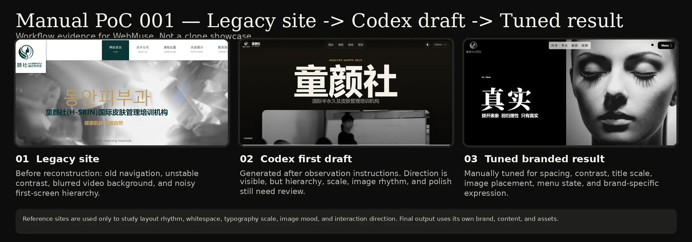
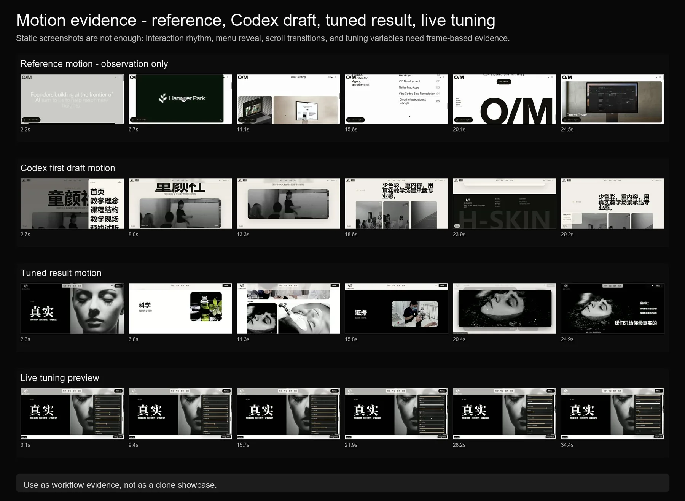
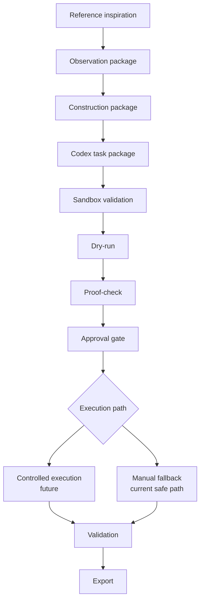

# WebMuse

From reference inspiration to your own branded website.

WebMuse, formerly WebRebuildRecorder, is an early-alpha open-source Windows desktop workbench for safer Codex-assisted reference-style website reconstruction workflows.

It helps developers and solo builders organize reference-site observations, prepare construction packages, validate sandbox boundaries, run dry-run checks, require approval gates, preserve rollback readiness, and export safer manual construction packages before real AI execution.



<p>
  <a href="docs/case-studies/manual-poc-001/#motion-evidence">
    View motion evidence: menu rhythm, scroll transitions, image mood, and live tuning preview
  </a>
</p>

<p>
  <a href="https://wxici.github.io/WebMuse/demo/manual-poc-motion.html">
    View browser-playable motion demo.
  </a>
</p>

<a href="docs/case-studies/manual-poc-001/#motion-evidence">
  
</a>

## Manual PoC evidence

WebMuse is based on a manual workflow that has already been tested: legacy site review, reference-site observation, Codex-assisted first draft generation, manual tuning, and validation.

See the first public case study:

```text
docs/case-studies/manual-poc-001/
```

This evidence shows why WebMuse focuses on observation packages, construction packages, tuning overrides, validation reports, sandbox boundaries, approval gates, and rollback readiness instead of one-shot website generation.

The case study also includes original-speed motion evidence showing why recording, frame extraction, and frame-based validation matter for menu behavior, scroll rhythm, image mood transitions, and live tuning previews.

## What is WebMuse?

WebMuse is a Windows desktop workbench for preparing safer AI-assisted website reconstruction workflows.

The project is designed around a simple idea: a good reference website should not be copied, but it can be studied. WebMuse helps organize the observation evidence, brand inputs, construction instructions, safety checks, and validation artifacts needed to transform reference-site inspiration into a user-owned branded website.

The long-term workflow is:

1. Collect reference-site observations.
2. Organize brand material, logo, copy, assets, and user intent.
3. Generate observation packages and construction packages.
4. Assemble Codex task packages.
5. Validate sandbox boundaries and write targets.
6. Run dry-runs and proof-checks before real execution.
7. Require approval gates before risky AI actions.
8. Preserve rollback readiness.
9. Preview, lightly tune, validate, and export the generated static website.

## What WebMuse is not

WebMuse is not:

- a website cloning tool;
- a tool for copying third-party brand assets;
- a drag-and-drop website builder;
- a CMS;
- an ecommerce system;
- a general page editor;
- a replacement for professional copyright review;
- a promise that AI can perfectly recreate a website in one pass.

The project focuses on reference-style reconstruction and brand-owned output. It studies structure, rhythm, whitespace, typography scale, motion behavior, color relationships, and visual mood, then helps transform those insights into a new branded website.

## Why this project exists

AI coding tools can generate frontend pages quickly, but real delivery requires more than code generation.

Early manual proof-of-concept work showed that AI-generated first drafts can capture broad structure and mood, but spacing, motion direction, image brightness, information density, brand replacement, and final polish still require structured observation and controlled tuning.

WebMuse exists to turn that manual workflow into a safer, repeatable, inspectable engineering process.

## Current status

WebMuse is in early alpha.

Current engineering focus:

- project-state management;
- project folder structure;
- `project.wrbproj`;
- sandbox path validation;
- package generation;
- dry-run orchestration;
- proof-check design;
- approval-gate design;
- rollback readiness;
- manual construction package fallback.

Not enabled yet:

- real Codex CLI execution;
- OpenAI API calls;
- website generation;
- WebView2 preview;
- tuning panel;
- Reference Portal;
- Design Context Library;
- ProposalPreview / SitePitcher.

The tuning overlays shown in the case study are manual PoC validation tools, not enabled product UI.

Real AI execution comes after safety gates, not before them.

## Manual proof-of-concept history

Before becoming a public OSS workbench, the workflow was tested manually through reference-site observation, AI/Codex-assisted page generation, visual comparison, manual CSS tuning, and validation.

That manual loop helped identify the features that WebMuse is now engineering into a safer workflow:

- observation packages;
- construction packages;
- tuning overrides;
- validation reports;
- sandbox rules;
- rollback readiness;
- approval gates;
- manual fallback.

See:

```text
docs/case-studies/manual-poc-history.md
docs/case-studies/manual-poc-001/
```

## Core workflow

```text
reference insight
  -> observation package
  -> construction package
  -> Codex task package
  -> sandbox validation
  -> dry-run
  -> proof-check
  -> approval gate
  -> controlled execution or manual fallback
  -> validation
  -> export
```

### Workflow diagram



Real AI execution is not enabled in the current alpha. The controlled execution path is shown as a future gated path.

## Safety-first engineering direction

WebMuse treats AI website construction as a controlled workflow rather than a one-shot prompt.

The project prioritizes:

- sandbox write boundaries;
- local path safety;
- generated artifact separation;
- dry-run records;
- proof-check files;
- approval persistence;
- rollback readiness;
- failure classification;
- manual export fallback.

## Repository structure

Important paths may include:

```text
WebRebuildRecorder.App/
WebRebuildRecorder.FoundationSelfTest/
docs/
docs/project-memory/
docs/case-studies/
.github/workflows/
```

Some internal source names still use the historical `WebRebuildRecorder` name. This is intentional for now. The public product name is WebMuse.

## Build and run

Requirements:

- Windows
- .NET 8 SDK
- WPF desktop support

Common commands:

```powershell
dotnet restore WebRebuildRecorder.slnx
dotnet build WebRebuildRecorder.slnx
dotnet run --project WebRebuildRecorder.App/WebRebuildRecorder.App.csproj
dotnet run --no-build --project WebRebuildRecorder.FoundationSelfTest/WebRebuildRecorder.FoundationSelfTest.csproj
```

## Roadmap

See:

```text
ROADMAP.md
```

## Contributing

See:

```text
CONTRIBUTING.md
```

## Security

Do not commit customer materials, API keys, tokens, Codex/OpenAI login files, generated media, recordings, extracted frames, local path configuration, or output-site artifacts.

See:

```text
SECURITY.md
```

## License

MIT License.
