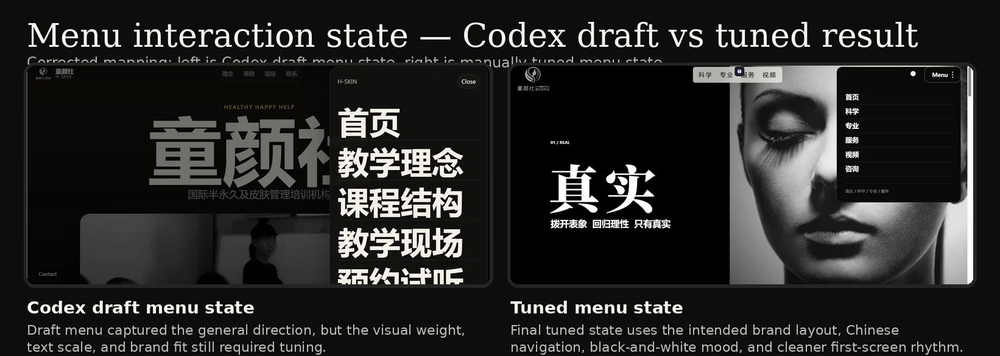
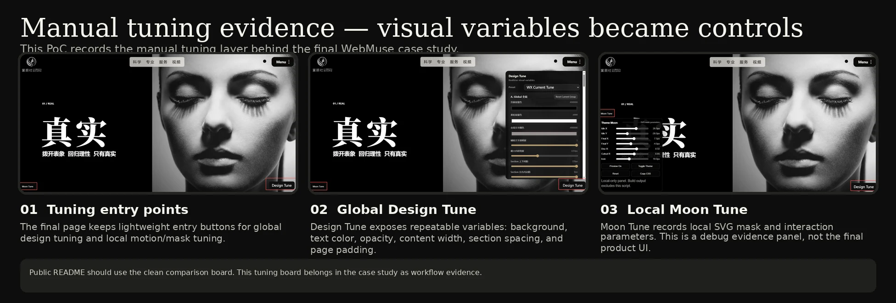

# Manual PoC 001 - Legacy site to tuned branded result

This case study documents an early manual proof of concept behind WebMuse.

The goal was not to clone a third-party website. The goal was to validate a workflow:

1. observe a reference site for layout rhythm, whitespace, typography scale, image mood, and interaction behavior;
2. review screenshots, recordings, or extracted frames;
3. convert observation evidence into construction instructions;
4. generate a first Codex-assisted draft;
5. manually tune spacing, contrast, image mood, typography, menu behavior, and first-screen hierarchy;
6. extract repeated manual decisions into future WebMuse workflow controls.

## Evidence board


## What changed

### Legacy site

The original page had an older visual structure, unstable text/background contrast, noisy first-screen hierarchy, and distracting consultation/footer elements.

### Codex first draft

The first AI/Codex-assisted draft captured a broad direction, but it still needed review for visual hierarchy, typography scale, spacing, image rhythm, menu behavior, and brand fit.

### Tuned branded result

The manually tuned result improved the first-screen structure, contrast, title scale, visual mood, menu state, and brand-specific expression.

## Interaction evidence



## Manual tuning evidence



This PoC records how manual visual decisions were exposed as repeatable tuning variables. The overlay panels are local-only validation tools and are not included in exported site output.

## Why tuning controls should move outside the webpage

The manual PoC exposed a limitation of in-page tuning overlays.

During visual validation, the tuning panels were useful because they made design decisions visible as adjustable variables. However, placing those controls inside the webpage creates several problems:

1. The overlay blocks the actual page being reviewed.
2. Screenshots become noisy and harder to use as public evidence.
3. Debug controls can accidentally look like part of the generated website.
4. Exported output must carefully exclude local-only tuning scripts and panels.

For this reason, future WebMuse tuning controls should move into an external WPF floating tuning window instead of remaining inside the webpage.

In the desktop application, the tuning window can float outside the WebView preview, move to another monitor, or dock beside the preview area. This keeps the website view clean while still allowing immediate visual adjustment.

The tuning window should not directly rewrite the original source files on every slider movement. Instead, it should first apply runtime CSS variable updates through the preview layer, such as injected CSS variables or a temporary override stylesheet. When the user confirms the result, WebMuse can persist the final values into `tune-overrides.css`, `tune-overrides.json`, or the generated theme layer.

This keeps the workflow safe:

- live preview remains immediate;
- the page itself stays visually unobstructed;
- debug UI is never exported as part of the final website;
- tuning decisions become repeatable project data;
- original generated files are not destructively edited during experimentation.

Recommended future architecture:

```text
WPF floating tuning window
  -> WebView2 ExecuteScriptAsync / postMessage
  -> runtime CSS variables / injected override style
  -> live preview
  -> user confirms
  -> tune-overrides.css / tune-overrides.json
```

## Reference boundary

The external reference source was used only to study layout rhythm, whitespace, typography scale, image mood, menu behavior, and interaction direction.

WebMuse does not aim to copy third-party brand assets, text, images, logos, or full website identities.

The intended workflow is:

```text
observe -> understand -> transform -> create a user-owned branded result
```

## What this proved

This manual loop showed why WebMuse needs:

- observation packages;
- construction packages;
- tuning overrides;
- validation reports;
- sandbox boundaries;
- approval gates;
- rollback readiness;
- manual fallback;
- external desktop tuning controls.
